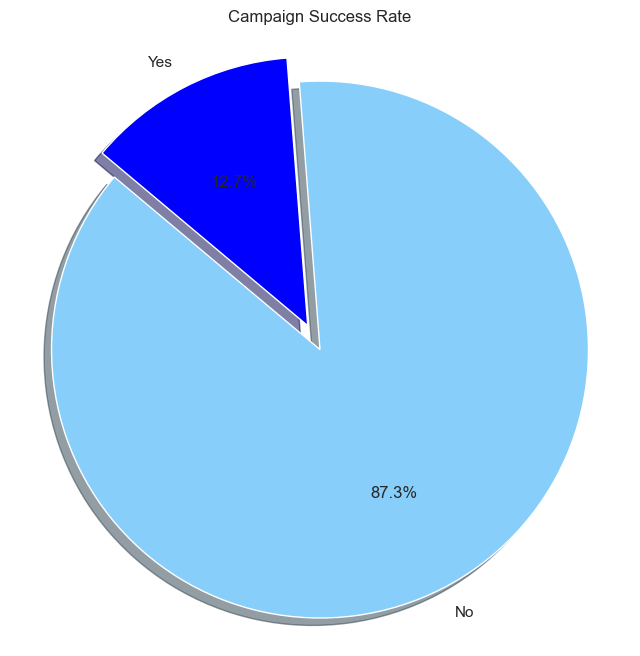
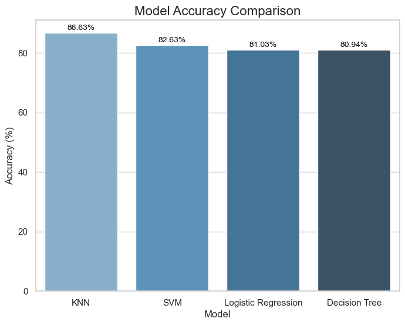
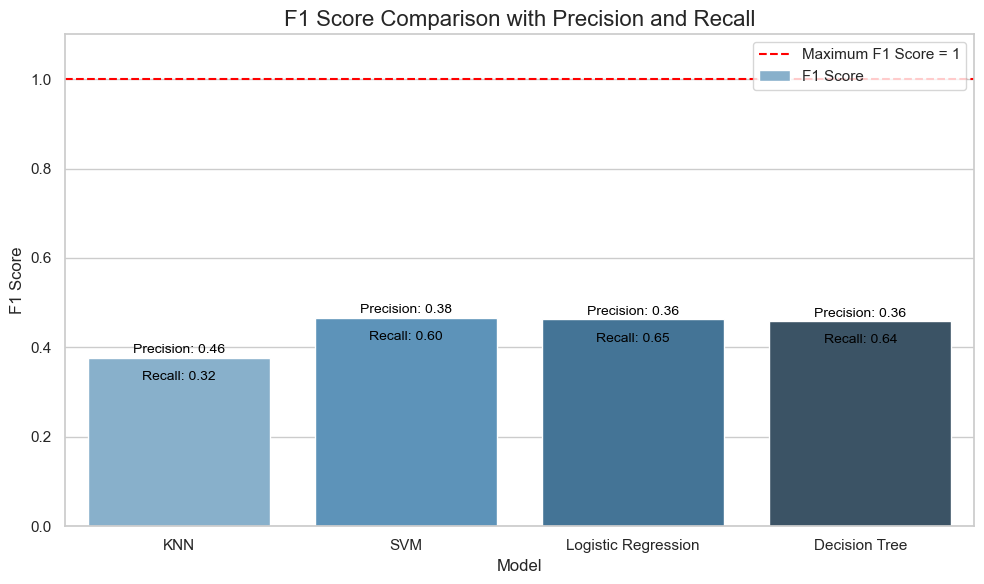
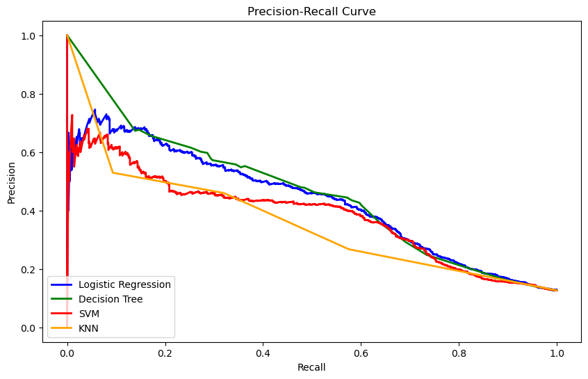
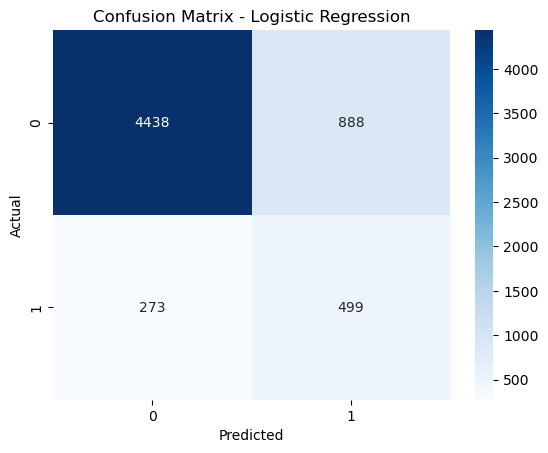
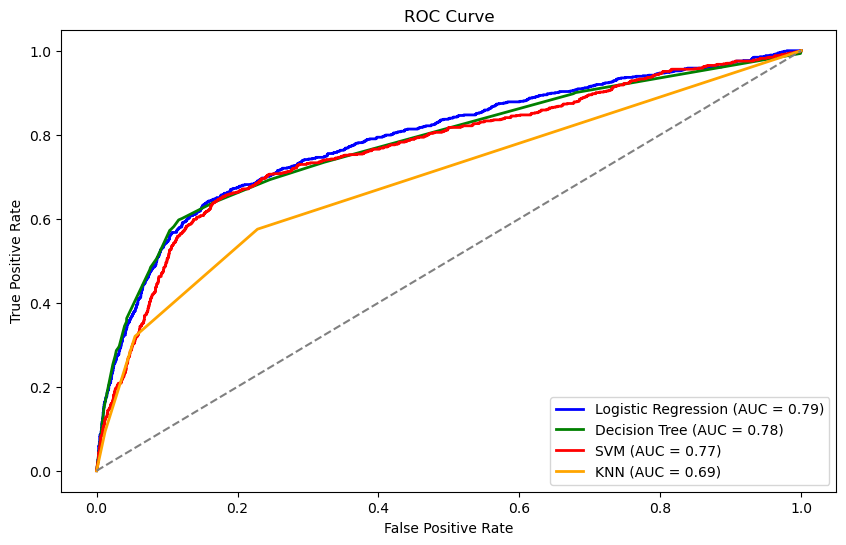

# Project: Comparing Classifiers for Predicting Bank Marketing Campaign Success

## Business Objective
This project aims to assist banks in identifying potential customers most likely to subscribe to their products based on historical marketing campaign data. By leveraging machine learning models to predict campaign outcomes, we seek to enhance the efficiency of future marketing efforts.

## Executive Summary

We analyzed a dataset from a Portuguese banking institution using four classification models: **K-Nearest Neighbors (KNN)**, **Logistic Regression**, **Decision Trees**, and **Support Vector Machines (SVM)**. Our goal was to compare these models' performance in predicting the success of marketing campaigns.

**Important Note on Data Imbalance**: The dataset used in this project is highly imbalanced, with a significantly lower number of successful campaign outcomes compared to unsuccessful ones. This imbalance is crucial to consider because:
1. It can lead to misleading accuracy scores, as a model that always predicts the majority class (unsuccessful campaigns) would appear to perform well.
2. It makes it more challenging to correctly identify the minority class (successful campaigns), which is often the class of interest in marketing scenarios.
3. It necessitates the use of metrics beyond accuracy, such as F1 score, precision, and recall, to get a more comprehensive view of model performance.

## Key Findings:

### Model Performance

#### Accuracy
Accuracy measures the proportion of correct predictions. While important, it may not fully capture model performance with imbalanced datasets like ours.

1. **K-Nearest Neighbors (KNN)**: 86.63%
2. **Support Vector Machines (SVM)**: 82.63%
3. **Logistic Regression**: 81.03%
4. **Decision Trees**: 80.94%

#### F1 Score
The F1 Score balances precision and recall, providing a more comprehensive evaluation, especially for our imbalanced data.

- Precision: Out of all the customers our model predicted would subscribe, what percentage actually did subscribe?
- Recall: Out of all the customers who actually subscribed, what percentage did our model correctly identify?

The F1 score is the harmonic mean of precision and recall, offering a single metric that balances both.

1. **SVM**: 0.4659
2. **Logistic Regression**: 0.4631
3. **Decision Trees**: 0.4590
4. **KNN**: 0.3773

#### Precision-Recall Curve
This curve illustrates the trade-off between precision and recall for different probability thresholds, which is crucial for our imbalanced dataset.

Key observations:
- Decision Tree shows the best overall performance, with its curve generally higher than others.
- All models show a typical sharp precision drop at very low recall, reflecting the dataset's imbalance.

#### Confusion Matrix
The Logistic Regression confusion matrix offers insights into true/false positives and negatives, helping understand where model errors occur. This is particularly important given our imbalanced dataset.

- True Negatives (0 correctly predicted as 0): 4438
- False Positives (1 incorrectly predicted as 0): 888
- False Negatives (0 incorrectly predicted as 1): 273
- True Positives (1 correctly predicted as 1): 499

#### ROC Curve
The Receiver Operating Characteristic (ROC) curve illustrates model performance across different classification thresholds. A higher Area Under the Curve (AUC) indicates better performance, even with imbalanced data.

### Conclusion
- While **KNN** achieved the highest accuracy, **SVM** and **Logistic Regression** demonstrated better balance between precision and recall (F1 score), which is crucial given our imbalanced dataset.
- Model selection should align with specific business needs (e.g., minimizing false positives vs. maximizing overall correct classifications), taking into account the challenges posed by the data imbalance.

## Detailed Analysis
For a comprehensive technical analysis, please refer to our [Jupyter Notebook](prompt_III.ipynb).